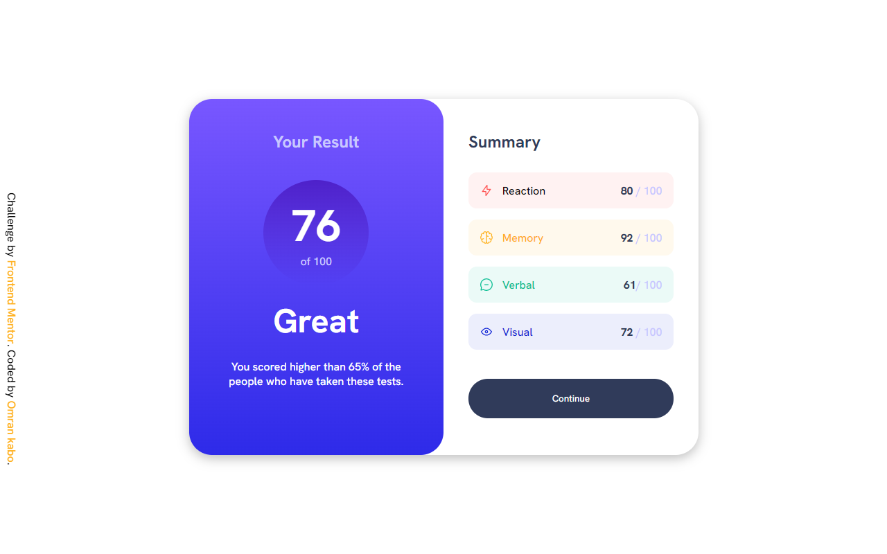

# Frontend Mentor - Results summary component solution

This is a solution to the [Results summary component challenge on Frontend Mentor](https://www.frontendmentor.io/challenges/results-summary-component-CE_K6s0maV). Frontend Mentor challenges help you improve your coding skills by building realistic projects. 

## Table of contents

- [Overview](#overview)
  - [The challenge](#the-challenge)
  - [Screenshot](#screenshot)
- [My process](#my-process)
  - [Built with](#built-with)
- [Author](#author)

**Note: Delete this note and update the table of contents based on what sections you keep.**

## Overview

### The challenge

Users should be able to:

- View the optimal layout for the interface depending on their device's screen size
- See hover and focus states for all interactive elements on the page

### Screenshot

## My process
i started with layout and tried to remake the design in figma than came back to html putting elements together than moving to css and root colors and fonts and removing default styling than i used flex box for layout and linear gradient for result section background for spacing i used margin in range of 16px to 46px and the same for padding for responsive desing for mobile i used flex direction property .

### Built with

- Semantic HTML5 markup
- CSS custom properties
- Flexbox

## Author
- Frontend Mentor - [@yourusername](https://www.frontendmentor.io/profile/Omrankabo)
- Twitter - [@kabo_omrans](https://twitter.com/kabo_omran)

